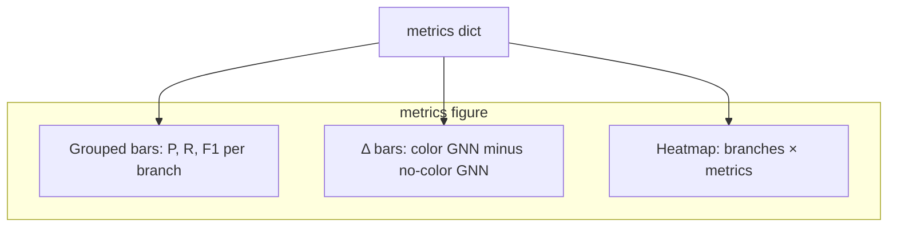

# Psypectrum

Multi-label emotion classification on [GoEmotions](https://huggingface.co/datasets/SetFit/go_emotions) using **BERT**, a **batch graph** built from CLS cosine similarity, and an optional **emotion–color** branch: per-label 3D vectors from a hand-designed [COLOR_MAP.txt](COLOR_MAP.txt) (valence and hue), weighted by sigmoid(BERT logits), projected and concatenated with normalized BERT embeddings, then passed through two GCN layers with a residual from the frozen BERT head.

Training is two-stage: warm up BERT and the linear head while the GNN is frozen, then freeze BERT and train the color projection, layer norms, GCN, and classifier jointly.

## Requirements

- Python 3.12
- PyTorch 2.x, Hugging Face `transformers` and `datasets`
- Matplotlib and NumPy (for metric figures)
- GPU strongly recommended (training and evaluation are CUDA-oriented in practice)

## Setup

```bash
conda env create -f environment.yml
conda activate psypectrum
```

Optional: set `HF_TOKEN` for higher Hugging Face Hub rate limits when downloading models and datasets.

**GPU note:** Standard pip PyTorch wheels target recent NVIDIA GPUs (compute capability 7.0+). Older cards (for example GTX 1080, sm_61) are not supported by those builds; use V100, L40, A100, or similar.

## Data and color map

- The dataset is loaded automatically from `SetFit/go_emotions` via the `datasets` library.
- [COLOR_MAP.txt](COLOR_MAP.txt) is a markdown table mapping each of the 28 GoEmotions labels to valence and hue. The code parses it into 3D vectors (saturation, hue plane, valence) and registers them as model buffers. Override the path with `color_map_path` when constructing or training if you keep a copy elsewhere.

## Training

From the repository root (so `palette_model.py` and `COLOR_MAP.txt` resolve correctly):

```python
import torch
from palette_model import run_full_pipeline

device = torch.device("cuda" if torch.cuda.is_available() else "cpu")
model, metrics = run_full_pipeline(
    bert_name="bert-base-uncased",
    batch_size_warmup=16,
    batch_size_joint=16,
    lr_warmup=2e-5,
    lr_joint=1e-3,
    max_length=128,
    epochs_warmup=3,
    epochs_joint=3,
    device=device,
    log_jsonl_path="logs/run.jsonl",  # optional: JSONL logs with logits during joint training
    metrics_plot_path="logs/metrics.png",  # optional: grouped bars, delta, heatmap (needs matplotlib)
)
```

`run_full_pipeline` returns validation metrics (micro precision, recall, and F1) for two ablations:

| Key | Meaning |
| --- | --- |
| `bert_color_gnn` | Full model: BERT embeddings + color features, GCN, residual. |
| `bert_gnn` | Same GCN and residual, but **no** color module: the 128-dimensional color slot is zero so only the BERT half of the first GCN input carries signal (same checkpoint, fair comparison to isolating the color branch). |

For programmatic evaluation with other splits or branches, use `evaluate_model(..., gnn_branch=...)`. Supported values include `full`, `bert_gnn` / `gnn_no_color`, and `bert_only` (BERT head only, no GNN).

A plain **BERT pooled + linear** baseline is available as `train_bert_only_baseline` / `BERTOnlyBaseline` in [palette_model.py](palette_model.py).

### Training knobs for recall / precision / F1

`run_full_pipeline` exposes the improvements we rolled in after the first 0.585 F1 run. Defaults are listed first.

| Knob | Default | What it does |
| --- | --- | --- |
| `loss_type` | `"asl"` | Asymmetric multi-label loss (Ben-Baruch et al.). Also supports `"bce"`, `"bce_weighted"` (auto pos_weight from train split), and `"focal"`. |
| `asl_gamma_pos` / `asl_gamma_neg` / `asl_clip` | `0.0 / 4.0 / 0.05` | ASL hyperparameters; stronger negative focusing helps rare-label recall. |
| `color_teacher_prob` | `0.5` | During training, each example uses ground-truth labels to build the color vector with this probability (otherwise predicted probs). Breaks the "color is a deterministic copy of BERT" problem. |
| `adj_temperature` | `0.25` | Sharper softmax over cosine similarities; less feature bleed across unrelated batch members. |
| `adj_topk` | `8` | Top-k sparsification of the batch graph. |
| `n_top_bert_layers` / `bert_lr_joint` | `2 / 2e-5` | Unfreeze the top N BERT transformer blocks during the joint phase with a small LR (discriminative learning rate). |
| `weight_decay` | `0.01` | AdamW weight decay, applied to non-bias/LayerNorm weights. |
| `max_grad_norm` | `1.0` | Gradient clipping. |
| `warmup_ratio` | `0.1` | Fraction of steps for linear LR warmup (rest is linear decay). |
| `early_stop` | `True` | Track best joint-phase validation micro-F1 and restore that `state_dict` before returning. |

`label_color_vectors` is a trainable `nn.Parameter` initialized from `COLOR_MAP.txt`, so the color branch can move away from the deterministic initialization during joint training.

## Metrics

Validation metrics use **micro** precision, recall, and F1 over all labels and examples: sigmoid on logits, threshold 0.5, then aggregate true/false positives and negatives (implemented in `multilabel_f1`).

### Visualization

[metrics_viz.py](metrics_viz.py) turns the nested metrics dict into one PNG with three panels:

1. **Grouped bar chart** — micro precision, recall, and F1 side by side for each model branch (`BERT + Color GNN` vs `BERT + GNN (no color)`).
2. **Delta chart** — bar length is the difference *full color model minus no-color GNN* so you can see whether the color module helps on each metric.
3. **Heatmap** — the same numbers in a 2×3 grid with a shared 0–1 color scale.

Pass `metrics_plot_path` into `run_full_pipeline` to save automatically, or call directly after any evaluation:

```python
from metrics_viz import plot_validation_metrics, save_pipeline_metrics_figure

save_pipeline_metrics_figure(metrics, "logs/val_metrics.png")
# Or: plot_validation_metrics(metrics, save_path="logs/val_metrics.png"); use show=True to display
```



## Cluster jobs (example)

[longleaf_train.pbs](longleaf_train.pbs) and [longleaf_palette.pbs](longleaf_palette.pbs) are Slurm job scripts tailored to UNC Longleaf: adjust `WORKDIR`, log paths, and partition/QOS to match your account and cluster documentation (for example [Longleaf Slurm examples](https://help.rc.unc.edu/longleaf-slurm-examples/)). Submit with `sbatch longleaf_train.pbs` after editing paths and loading your conda environment on a login node.

## Layout

| Path | Role |
| --- | --- |
| [palette_model.py](palette_model.py) | Dataset, `EmotionColorGNNBERT`, training loops, evaluation, `run_full_pipeline` |
| [metrics_viz.py](metrics_viz.py) | Matplotlib figures for validation metrics |
| [COLOR_MAP.txt](COLOR_MAP.txt) | Per-label valence and hue for the color branch |
| [environment.yml](environment.yml) | Conda environment definition |
